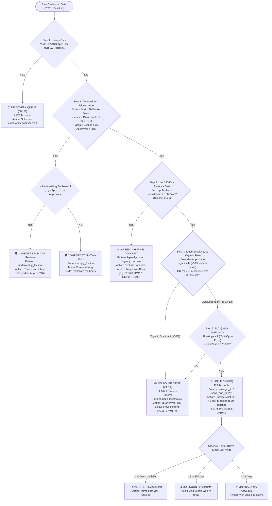

# Dealer Relationship Demand (DRD) Decision Flowchart

> [!NOTE]
> **Operational Baseline Anchor:** The engine evaluates live operational truth anchored from **January 1, 2025 onward**. Stale 2020–2024 records are excluded from live route planning.

---

## 1. Visual Flow Diagram (Mermaid)



---

## 2. Complete Step-by-Step Decision Matrix

| Step | Rule / Threshold | Outcome | Assigned Pattern & Urgency | Field & Management Action | Real World Examples |
| :--- | :--- | :--- | :--- | :--- | :--- |
| **1. History Gate** | `Visits < 2` AND `Apps < 5` AND `Vol < $100K` | **⚪ Discovery Queue** | `unexplored` <br> `not_monitored` | Schedule exploratory baseline visit to assess financing potential. | **MO193**, **CO104** (0 activity in 2025+) |
| **2A. Time Sink Gate** | `Visits >= 3` with `$0` volume OR `Visits >= 15` with `< $25K` yield/visit | **🟠 Comfort Stop (Time Sink)** | `empty_friction` <br> `not_monitored` | Freeze field driving trips immediately. Reallocate rep hours to High TLC accounts. | **OH128** (16 visits, $0 booked) |
| **2B. Underwriting Gate** | `Visits >= 3` AND `Apps >= 35` AND `Approval Rate <= 20%` | **🟠 Comfort Stop (UW Review)** | `underwriting_friction` <br> `not_monitored` | **Do not penalize sales rep.** Rep is driving dealer adoption; coordinate with underwriting to review credit box. | **TX246** (27 visits, 106 apps, 8% approval) |
| **3. Recency Gate** | `Days Since Last App > 180` (Silent in 2026) | **💤 Lapsed / Churned** | `lapsed_churn` <br> `dormant` | Exclude from active weekly driving routes. Queue for Marketing Win-Back / Reactivation campaign. | **NC128** (Silent 349d), **KY112** (Silent 255d), **OH194** (Silent 493d) |
| **4. Organic Baseline** | `Organic Ratio >= 50%` OR `Unvisited > 120d` with `Vol >= $100K` | **🟢 Self-Sufficient** | `autonomous_locomotive` <br> `self_sufficient` | Deprioritize driving road trips. Maintain account health via quarterly (90-day) digital check-ins. | **17401746** ($32.4M vol, 0 visits), **TX108** ($16.9M vol, 87% organic) |
| **5. High TLC Multi-Cycle** | `Post-Visit Lift >= 60%` AND `Bookings >= 2` AND `Yield/Visit >= $20K` | **🔴 High TLC** | `strategic_tlc` <br> `overdue` / `due_soon` / `on_track` | Enforce strict **30–45 day in-person route cadence** to prevent dealer loan production cliff. | **FL340** ($3.12M vol, 100% lift), **AZ252** ($2.19M vol, 73% lift) |

---

## 3. High TLC Sales Rep Urgency Router

For the **119 High TLC accounts**, the system continuously tracks the number of days since the rep was physically on-site:

```
                  ┌────────────────────────────────────────────────────────┐
                  │                 HIGH TLC URGENCY ROUTER                │
                  └───────────────────────────┬────────────────────────────┘
                                              │
                    ┌─────────────────────────┼─────────────────────────┐
                    ▼                         ▼                         ▼
          ┌───────────────────┐     ┌───────────────────┐     ┌───────────────────┐
          │    🚨 OVERDUE     │     │    ⏳ DUE SOON    │     │    ✅ ON TRACK    │
          │   (65 Accounts)   │     │   (8 Accounts)    │     │   (46 Accounts)   │
          ├───────────────────┤     ├───────────────────┤     ├───────────────────┤
          │ > 35 Days Silence │     │ 28 to 35 Days     │     │ < 28 Days         │
          │ Immediate visit   │     │ Add to next       │     │ Lift envelope     │
          │ alert triggered   │     │ week's route      │     │ currently active  │
          └───────────────────┘     └───────────────────┘     └───────────────────┘
```

---

## 4. Current 3,940 Account Network Breakdown

```
========================================================================================
                      FINAL AUDITED NETWORK SEGMENTATION (v6.2)                         
========================================================================================

🔴 HIGH TLC (Visit-Dependent)        : 119 Accounts (3.0%)
   • True touch-dependent accounts with verified multi-cycle lift (>=60%) and >=$20K yield
   • 65 Overdue | 8 Due Soon | 46 On Track

🟢 SELF-SUFFICIENT (Autonomous)      : 1,167 Accounts (29.6%)
   • Active digital/organic accounts generating >=50% of loan volume without road trips
   • Includes flagged Lapsed Churn accounts queued for marketing win-back

🟠 COMFORT STOP (Friction / Sinks)   : 681 Accounts (17.3%)
   • Disambiguates true empty visits from Underwriting / Credit Box friction

⚪ DISCOVERY QUEUE (Insufficient)   : 1,973 Accounts (50.1%)
   • Accounts with <2 visits and <5 applications in 2025–2026
========================================================================================
```
