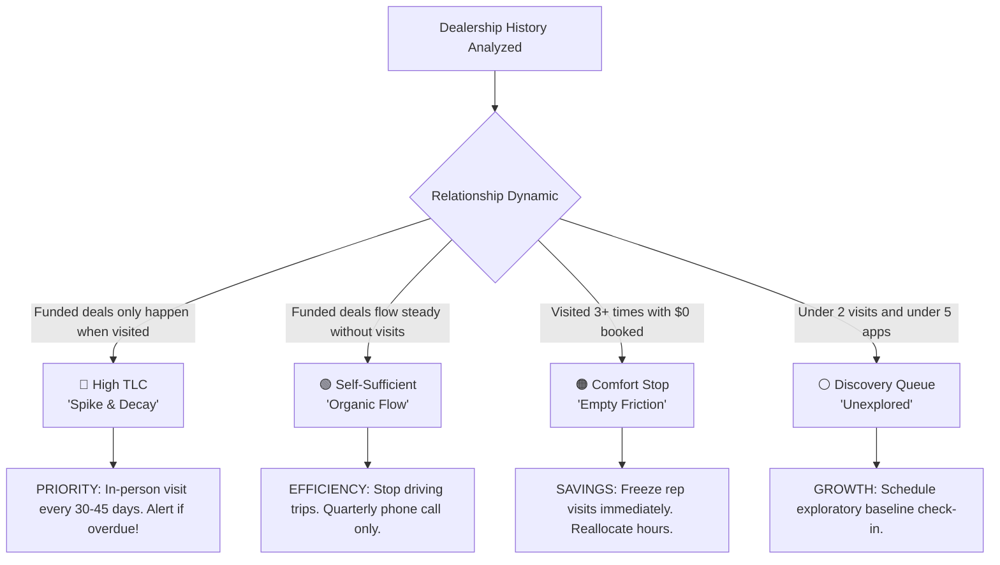

# Source One Financial Services
## Feature Specification: Dealer Relationship Demand (DRD) & Field Visit Allocation Engine

---

## 1. The Business Problem: Why Are We Building This?

Source One Financial partners with **3,940 dealer rooftops** across 48 states, funding over **$2.18 Billion** in recreational and specialty consumer vehicle loans. 

Our field sales representatives spend hundreds of hours every month driving thousands of miles to visit dealership finance managers. However, without data-driven intelligence on how dealerships actually react to sales visits, the sales team falls into **three massive operational traps**:

```
                               THE THREE FIELD SALES TRAPS
┌──────────────────────────────┬──────────────────────────────┬──────────────────────────────┐
│  TRAP 1: The Neglected       │  TRAP 2: The Wasted          │  TRAP 3: The "Comfort Stop"  │
│          Cash Cow            │          Road Trip           │          Time Sink           │
├──────────────────────────────┼──────────────────────────────┼──────────────────────────────┤
│ Dealers that ONLY produce    │ Dealers that organically     │ Dealers where reps visit     │
│ loans when a rep visits.     │ submit millions in loans     │ 20+ times to chat and drink  │
│ If the rep stops visiting,   │ through our online portal.   │ coffee, but the dealer books │
│ funded deals drop to ZERO.   │ Sending reps to visit them   │ $0 in loans over years.      │
│ (Huge revenue left on table) │ burns gas and adds zero $.   │ (Pure waste of company money)│
└──────────────────────────────┴──────────────────────────────┴──────────────────────────────┘
```

### The Real-World Example (from Executive Review)
> *"A rep hadn't visited a dealer for over 100 days. He visited in January 2026, and we immediately booked a deal in January 2026. Since then, the rep hasn't visited, and we haven't booked a single deal since. That dealer strictly requires constant interaction to produce revenue."*  
> — **Joseph Krimker, Executive Leadership**

---

## 2. The Solution: The Relationship Demand Engine

Instead of guessing where reps should spend their travel time, the **Relationship Demand Engine** analyzes the complete lifetime history of every single dealership—every loan application, every funded contract, and every sales visit—to classify each rooftop into one of **Four Crystal-Clear Buckets**:

---

### The 4 Relationship Buckets & Field Actions



| Relationship Bucket | What It Means in Plain English | Real Example from Our Database | What the Sales Team Must Do |
|---|---|---|---|
| **🔴 High TLC** *(Visit-Dependent)* | **The "Spike & Decay" Dealer**: When a rep visits, funded deal volume immediately surges for 30–45 days. When the rep stops visiting, deal flow dies. *(Deals must be **Booked**; high app count with $0 booked is NOT High TLC).* | **Auction Direct RV (FL319)**: Visited 9 times. **94% of their applications** were submitted within 45 days of a visit, generating **30 booked deals ($572K)**. When unvisited for >60 days, deal production drops to 0. | **High Priority Route**: Put this dealer on a mandatory **30–45 day in-person route**. If overdue, fire a red alert to the sales manager. |
| **🟢 Self-Sufficient** *(Autonomous Flow)* | **The "Organic Producer"**: These dealers submit loans consistently through their computer portal without needing a sales rep to show up in person. | **RGV RV Sales (TX569)**: Only visited **2 times ever**, yet booked **53 loans ($2.59M)** in steady, uninterrupted monthly flow! | **Save Travel Budget**: Do **not** send reps driving to this dealer. Maintain a friendly quarterly phone call or digital check-in. |
| **🟠 Comfort Stop** *(Time Sink)* | **The "Coffee Stop"**: Reps repeatedly visit in person, but the dealer never converts into funded loans ($0 booked). | **Hilltop Trailer Sales (MN329)**: Rep logged **28 in-person visits**, but the dealer generated **$0 in booked loan volume**. | **Freeze Visits Immediately**: Stop spending driving time and travel budget here. Reallocate those hours to overdue High TLC dealers. |
| **⚪ Discovery Queue** *(Unexplored)* | **The "New / Under-Visited Dealer"**: Rooftops that have received fewer than 2 visits and submitted fewer than 5 applications. | **Rockingham Marina (ETN111)**: 1 visit, 0 apps, 0 booked. | **Explore Potential**: Place on the exploratory route queue for a first baseline discovery visit. |

---

## 3. The User Experience: What Sales Leadership Will See

We redesigned the interface to eliminate confusing data-science jargon (like *"Elasticity"* or *"Half-Life"*) and replaced clumsy floating popups with a smooth, unified workflow.

---

### A. The Master Sales Manager Dashboard (`RelationshipDemandView`)
The main view has **3 dedicated tabs**:

1. **Executive Allocation & Overdue Action Queue**:
   * **4 Top Metric Banners**: Shows total count of High TLC accounts and the exact **Funded Loan Dollars ($) at Immediate Risk** due to overdue visits.
   * **The Sales Rep Visit Matrix**: Lists every sales rep alongside how many High TLC accounts they have (Overdue, Due Soon, On Track).
   * **Instant Click-to-Filter**: Clicking the red badge **"32 Overdue"** on George Ott immediately filters the table below to George's 32 overdue High TLC accounts!
2. **Dealer Relationship Explorer**:
   * Master searchable list of all 3,940 dealers.
   * Plain-English columns: *Dealer Name, Rep, Status Badge, Urgency, Post-Visit Booked Lift %, Total Funded $, Yield Per Visit, Decision Summary Pill, Action*.
3. **Rep Misallocation Diagnostic**:
   * Instantly highlights reps who are wasting $>40\%$ of their travel time visiting Comfort Stops or Autonomous dealers while their High TLC cash cows are sitting overdue.

---

### B. The Slide-Out Inspection Drawer (`DealerRelationshipDrawer`)
Clicking any dealer row opens a sleek **full-height right-side slide drawer** (no more floating modals blocking the screen):

```
┌────────────────────────────────────────────────────────────────────────┐
│  FL319 — Auction Direct RV                           [🔴 HIGH TLC]     │
│  Assigned Rep: George Ott  │  Status: 🚨 OVERDUE (54 Days Unvisited)   │
├────────────────────────────────────────────────────────────────────────┤
│  📋 SYSTEM DECISION AUDIT (Why is this dealer classified as High TLC?) │
│  • Verified "Spike & Decay" pattern across 3 independent visit clusters│
│  • 100% of booked loan volume ($572K) occurred within 45 days of an   │
│    in-person rep visit.                                                │
│  • Production dropped to ZERO during every unvisited gap >60 days.     │
│  • Action: Enforce 30–45 day visit route. Currently 54 days unvisited. │
├────────────────────────────────────────────────────────────────────────┤
│  📊 CAUSE & EFFECT TIMELINE (The Visual Proof)                         │
│                                                                        │
│  Monthly Funded $   ┌─┐📍                        ┌─┐📍                 │
│  $100K ┤      ┌─┐   │ │                    ┌─┐   │ │                   │
│   $50K ┤┌─┐📍 │ │   │ │              ┌─┐📍 │ │   │ │                   │
│    $0K ┴┴─┴───┴─┴───┴─┴──────────────┴─┴───┴─┴───┴─┴─────              │
│        Nov25 Dec25 Jan26 Feb26 Mar26 Apr26 May26 Jun26                 │
│          ▲                  ▲          ▲                               │
│       Visit 1            Dormant    Visit 2                            │
│                                                                        │
│  (The green bars spike directly under the red 📍 visit pins!)          │
├────────────────────────────────────────────────────────────────────────┤
│  📑 STRUCTURED VISIT CYCLES (Expandable History)                       │
│  ▶ Cycle 3 (May 2026): Visit May 19 → 14 Apps, 5 Booked ($115K)        │
│  ▶ Cycle 2 (Feb 2026): Visit Feb 10 → 11 Apps, 4 Booked ($88K) → Died   │
│  ▶ Cycle 1 (Nov 2025): Visit Nov 14 → 8 Apps, 2 Booked ($42K) → Died    │
└────────────────────────────────────────────────────────────────────────┘
```

---

## 4. Hardened Technical Specification: The 5 Engineering Rules

### Rule 1: Booked Deals ($ and Count) Is the Primary Signal
* **Funded Loan Conversion ($)** is the economic foundation of the platform.
* Application submissions serve strictly as a secondary pipeline velocity indicator.
* **Hard Constraint**: A rooftop that generates applications but **$0 in booked loans** after visits is classified as a **Comfort Stop**, never High TLC.

---

### Rule 2: Hard Visit Clustering & Attribution
* **Visit Clustering**: Any in-person visits occurring within **$<45$ days** of each other merge into a single **Visit Cluster** $[t_{\text{start}}, t_{\text{end}}]$.
* The **Post-Visit Evaluation Window** is measured strictly from the **last visit** in the cluster: $[t_{\text{end}}, t_{\text{end}} + 45\text{ days}]$.
* **Independent Cycles**: An independent cycle exists only when separated from other clusters by a cold gap of $\ge 45$ days with zero visits.
* `verifiedCycleCount` = the number of **independent clusters**, preventing reps who visit weekly from creating false cycle inflation.

---

### Rule 3: Relative Booked Lift & Post-Window Decay
* **Pre-Visit Baseline Rate ($R_{\text{pre}}$)**: Average monthly booked volume in the 45–60 days preceding the cluster.
* **Post-Visit Rate ($R_{\text{post}}$)**: Monthly booked volume in the 45 days following the cluster end.
* **Relative Booked Lift Formula**:
$$\text{Relative Lift } \Lambda = \frac{R_{\text{post}} - R_{\text{pre}}}{\max(R_{\text{pre}}, 0.5)}$$
* **High TLC Verification Criteria**:
  * $\ge 2$ Independent Visit Clusters.
  * Relative Booked Lift $\Lambda \ge 2.0\times$ (deal flow doubles or reactivates from zero).
  * Post-Window Decay Confirmed: Deal flow drops to $\le 1$ app / $0 booked in the subsequent unvisited period $[t_{\text{end}} + 45\text{d}, t_{\text{end}} + 90\text{d}]$.
* **Emerging High TLC**: Exactly 1 verified cycle $\implies$ System alerts sales manager to **schedule a confirmation visit within 30 days**.

---

### Rule 4: `DailyDealerSnapshot` as First-Class Backbone
* The engine coordinates directly with existing **`DailyDealerSnapshot`** documents.
* Pre-computed daily snapshot fields (`activityStatus`, `daysSinceLastBooking`, `reactivatedAfterVisit`) are utilized for instantaneous urgency calculation and dormancy entry/exit tracking, eliminating expensive full-history table scans on user requests.

---

### Rule 5: Seasonality Normalization (v1)
* RV lending is strongly seasonal (peak spring/summer, low winter).
* Before evaluating pre/post visit deltas, the engine normalizes volume against regional monthly seasonal baselines so that winter dormancy is not falsely classified as visit decay.

---

### Rule 6: Channel Normalizer (Jeriko + Badger Maps)
* **2024–2025 (Jeriko)**: Reads `communicationType` directly.
* **2026 (Badger Maps)**: Maps `communicationResult1` (`"Met with existing contact"`, `"Training completed"`, etc.) to in-person visits, recovering **5,694 in-person visits** from 2026.

---

## 5. Summary Table: Before vs. After

| Operational Area | Before This Feature | With New DRD Engine |
|---|---|---|
| **Field Sales Strategy** | Reps decide where to drive based on habit or personal relationships. | Data-driven route schedule targeting high-yield TLC accounts. |
| **Wasted Road Trips** | Reps making 28 visits to dealers with $0 in lifetime loan bookings. | Comfort Stops are flagged; visits frozen; driving hours saved. |
| **Revenue Protection** | High TLC dealers go 100+ days without a visit; loan volume drops to $0. | Automated Overdue Alerts trigger before production dies. |
| **User Experience** | Confusing mathematical jargon ("elasticity", "half-life") and clunky popups. | Plain-English explanations, visual Cause & Effect charts, and slide-out drawers. |
