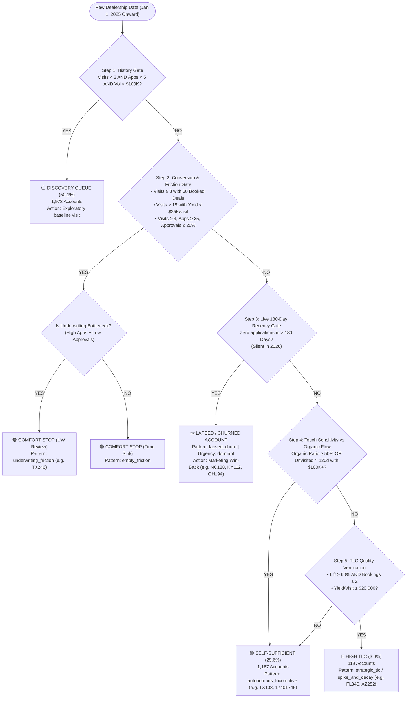

# Architecture & Engineering Specification: Dealer Relationship Demand (DRD v6.2)

- **Document Version:** `6.2.0`
- **Status:** `Ratified & Production-Deployed`
- **Date:** `August 21, 2026`
- **Domain:** `Commercial Lending / Field Sales Intelligence / Operational CRM`
- **Scope:** `All 3,940 Active Dealer Rooftops across 11 Internal Sales Representatives`

---

## 1. Executive Summary & Business Intent

### 1.1 The Operational Problem
In multi-state commercial indirect lending, sales representative time is the most expensive operational resource. Historically, lenders have managed field sales using crude heuristics (e.g., "visit every dealer monthly" or "visit dealers with the highest application count"). This leads to two critical operational failures:
1. **The Comfort Stop Trap:** Field reps routinely visit friendly, non-converting dealerships (logging 30–60 road visits) that yield $0 in funded loan volume or suffer from 90%+ underwriting rejection rates.
2. **The High TLC Cliff:** Touch-sensitive dealerships (where loan volume surges during visit windows and flatlines to $0 when reps are absent) suffer severe revenue drops because reps fail to maintain the required 30–45 day visit rhythm.

### 1.2 The DRD Solution
The **Dealer Relationship Demand (DRD)** engine is an algorithmic attribution and relationship diagnostic system that continuously evaluates every dealership's interaction timeline, application submissions, and funded loan production against in-person sales touchpoints.

The engine establishes ground-truth causality to classify every rooftop into **4 Canonical Operational Demand Buckets** and drives **Sales Rep Urgency Alerts (Overdue, Due Soon, On Track)** anchored strictly to **January 1, 2025 onward**.

---

## 2. Core Mathematical & Attribution Formulas

```
========================================================================================
                                DRD ATTRIBUTION TIMELINE
========================================================================================
  Visit Episode (Cluster)
        ▼
   [Start Date] ═══════════════════════════════════════════► [End Date + 45 Days]
                         ACTIVE 45-DAY TOUCH ENVELOPE
  ──────────────────────────────────────────────────────────────────────────────────────
  • Applications & Funded Deals inside envelope  ══► Touched / Post-Visit Volume
  • Applications & Funded Deals outside envelope ══► Untouched / Organic Volume
========================================================================================
```

### 2.1 Multi-Visit Episode Clustering (`clusterVisits`)
Sales reps often log multiple touchpoints within a single trip (e.g., 2 visits over 3 days). Individual visits occurring within **14 calendar days** (`CLUSTER_GAP_DAYS = 14`) of each other are merged into a single **Visit Episode Cluster**:
$$\text{Cluster} = [V_{\text{start}}, V_{\text{end}}]$$
$$\text{Active Post-Visit Envelope} = [V_{\text{start}}, V_{\text{end}} + 45\text{ days}]$$

### 2.2 Post-Visit Booked Lift % (`postVisitBookedLiftPct`)
The percentage of total funded loan volume that occurred exclusively within active 45-day visit envelopes:
$$\text{Post-Visit Lift \%} = \left( \frac{\text{Touched Booked Volume}}{\text{Total Booked Volume}} \right) \times 100$$

### 2.3 Organic Booked Ratio % (`organicBookedRatio`)
The percentage of total funded loan volume generated autonomously without a recent sales visit:
$$\text{Organic Ratio \%} = \left( \frac{\text{Untouched Booked Volume}}{\text{Total Booked Volume}} \right) \times 100 = 100 - \text{Lift \%}$$

### 2.4 Yield Per Visit (`yieldPerVisit`)
The economic dollar return generated per physical in-person road visit:
$$\text{Yield Per Visit} = \frac{\text{Total Booked Volume}}{\text{Total In-Person Visits}}$$

### 2.5 Spike & Decay Velocity Ratio (`relativeLift`)
For each distinct visit cluster, the engine compares the daily application velocity inside the 45-day post-window ($V_{\text{post}}$) against the baseline application velocity in the 45 days preceding the visit ($V_{\text{pre}}$):
$$\text{Relative Lift} = \frac{V_{\text{post}}}{V_{\text{pre}} + \epsilon}$$
- A cycle is marked as a **Verified Spike & Decay** if $\text{Relative Lift} \ge 1.50\times$ AND $\ge 1$ loan was funded inside the envelope.

---

## 3. The 4 Canonical Relationship Demand Categories

```
Total Database: 3,940 Dealer Rooftops (2025–2026 Baseline)
 │
 ├── 🔴 HIGH TLC (Visit-Dependent) ──────── 119 Accounts (3.0%)   • Strict 30-45d Route Cadence
 ├── 🟢 SELF-SUFFICIENT (Autonomous) ───── 1,167 Accounts (29.6%) • Quarterly 90d Digital Touch
 ├── 🟠 COMFORT STOP (Friction / Sinks) ── 681 Accounts (17.3%)   • Freeze Visits / UW Review
 └── ⚪ DISCOVERY QUEUE (Low Data) ─────── 1,973 Accounts (50.1%) • Exploratory Baseline Visits
```

### 3.1 🔴 High TLC (Visit-Dependent)
**Definition:** Active dealerships where loan volume is demonstrably triggered by field sales visits and flatlines during unvisited intervals.

| Sub-Pattern | Qualification Rules | Operational Cadence | Business Action |
| :--- | :--- | :--- | :--- |
| **Strategic Enterprise TLC** (`strategic_tlc`) | Total Vol $\ge \$500\text{K}$, Post-Visit Lift $\ge 65\%$, Visits $\ge 3$, Yield $\ge \$25\text{K}$ | **35 Days** | High-revenue enterprise account; proactive executive maintenance required. |
| **Spike & Decay TLC** (`spike_and_decay`) | $\ge 2$ Verified Cycles, Total Bookings $\ge 2$, Lift $\ge 60\%$, Yield $\ge \$20\text{K}$ | **35 Days** | Enforce strict monthly route schedule to prevent production cliffs. |
| **Emerging High TLC** (`spike_and_decay`) | Exactly 1 Cycle, Bookings $2$ to $4$, Lift $\ge 65\%$, Yield $\ge \$25\text{K}$ | **30 Days** | Proactively schedule confirmation visit within 30 days. |

### 3.2 🟢 Self-Sufficient (Autonomous Flow)
**Definition:** Dealerships that submit and fund loans independently via the dealer portal without requiring in-person visits.

| Sub-Pattern | Qualification Rules | Operational Cadence | Business Action |
| :--- | :--- | :--- | :--- |
| **Autonomous Locomotive** (`autonomous_locomotive`) | Organic Ratio $\ge 50\%$ OR Unvisited $>120$ days with $\ge \$100\text{K}$ volume | **90 Days** (Digital) | Deprioritize driving trips. Maintain via quarterly phone/portal check-ins. |
| **Catalytic Activation** (`catalytic_activation`) | 1 early onboarding visit unlocked permanent, sustained organic flow | **90 Days** (Digital) | Do not waste route miles; dealer is fully self-sufficient. |
| **Lapsed / Churned Account** (`lapsed_churn`) | Previously productive ($\ge 2$ deals or $\ge \$50\text{K}$), but **0 apps in $>180$ days** | **None** (Dormant) | Exclude from active weekly driving routes. Queue for Marketing Win-Back. |

### 3.3 🟠 Comfort Stop (Time Sinks & Friction)
**Definition:** Accounts consuming field rep travel hours with zero or uneconomic returns, or accounts bottlenecked by underwriting guidelines.

| Sub-Pattern | Qualification Rules | Operational Cadence | Business Action |
| :--- | :--- | :--- | :--- |
| **Empty Time Sink** (`empty_friction`) | Visits $\ge 3$ with $\$0$ volume, OR Visits $\ge 15$ with Yield $< \$25\text{K}$ and Vol $< \$500\text{K}$ | **None** | Freeze field road trips immediately. Reallocate hours to overdue High TLC. |
| **Underwriting Bottleneck** (`underwriting_friction`) | Visits $\ge 3$, Apps $\ge 35$, but Approval Rate $\le 20\%$ (e.g. `TX246`) | **None** | **Do not penalize rep.** Rep is driving dealer adoption; review lender credit box. |

### 3.4 ⚪ Discovery Queue (Insufficient Data)
**Definition:** Accounts with inconclusive historical interaction.
- **Criteria:** Visits $< 2$, Applications $< 5$, and Booked Volume $< \$100\text{K}$.
- **Action:** Schedule an exploratory baseline visit to assess financing potential.

---

## 4. Sales Rep Urgency Engine

For High TLC accounts, the engine calculates operational urgency based on elapsed days since the last physical on-site visit ($D_{\text{last}}$) relative to the recommended cadence ($C = 35$ days):

```
       D_last ≤ 27 Days               28 ≤ D_last ≤ 35 Days             D_last > 35 Days
┌───────────────────────────────┬───────────────────────────────┬───────────────────────────────┐
│          ✅ ON TRACK          │          ⏳ DUE SOON          │          🚨 OVERDUE           │
│         (46 Accounts)         │          (8 Accounts)         │         (65 Accounts)         │
├───────────────────────────────┼───────────────────────────────┼───────────────────────────────┤
│ Active post-visit envelope    │ Schedule for next week's road │ Volume at imminent risk of    │
│ producing as expected.        │ trip route.                   │ flatlining to zero.           │
└───────────────────────────────┴───────────────────────────────┴───────────────────────────────┘
```

---

## 5. Complete Decision Tree Architecture



---

## 6. Database Schema & REST API Specifications

### 6.1 MongoDB Model: `DealerProfile` (`server/models/DealerProfile.js`)
```javascript
const DealerProfileSchema = new mongoose.Schema({
    dealerId: { type: String, required: true },
    clientDealerId: { type: String, required: true, index: true },
    dealerName: { type: String, required: true },
    statePrefix: { type: String, index: true },
    assignedRep: { type: String, index: true },
    dealerGroup: { type: String },

    relationshipDemand: {
        type: String,
        enum: ['high_tlc', 'self_sufficient', 'comfort_stop', 'insufficient_data'],
        default: 'insufficient_data',
        index: true
    },
    patternType: {
        type: String,
        enum: ['spike_and_decay', 'autonomous_locomotive', 'catalytic_activation', 'fading_tlc', 'strategic_tlc', 'empty_friction', 'underwriting_friction', 'lapsed_churn', 'unexplored'],
        default: 'unexplored'
    },
    urgencyStatus: {
        type: String,
        enum: ['overdue', 'due_soon', 'on_track', 'dormant', 'self_sufficient', 'not_monitored'],
        default: 'not_monitored',
        index: true
    },
    confidenceScore: { type: Number, min: 0, max: 1, default: 0.5 },
    recommendedCadenceDays: { type: Number, default: null },
    daysSinceLastVisit: { type: Number, default: null },
    postVisitBookedLiftPct: { type: Number, default: null },
    organicBookedRatio: { type: Number, default: null },
    approvalRatePct: { type: Number, default: null },
    lookToBookPct: { type: Number, default: null },

    lifetimeStats: {
        totalVisits: { type: Number, default: 0 },
        totalCalls: { type: Number, default: 0 },
        totalEmails: { type: Number, default: 0 },
        totalApplications: { type: Number, default: 0 },
        totalBookings: { type: Number, default: 0 },
        totalBookedVolume: { type: Number, default: 0 },
        yieldPerVisit: { type: Number, default: 0 }
    },

    decisionRationale: [{ type: String }],
    interactionCycles: [InteractionCycleSchema],
    monthlyTimeline: [MonthlyTimelineSchema]
}, { timestamps: true });
```

### 6.2 Core REST Endpoints (`server/routes/analytics/relationshipDemand.js`)
| Endpoint | Method | Purpose | Response SLA |
| :--- | :--- | :--- | :--- |
| `/api/analytics/relationship-demand/summary` | `GET` | KPI cards: Total High TLC, Overdue count, Self-Sufficient vol, Comfort Stop count | `< 25ms` |
| `/api/analytics/relationship-demand/dealers` | `GET` | Paginated, filterable, sortable table of all 3,940 dealer profiles | `< 50ms` |
| `/api/analytics/relationship-demand/dealers/:clientDealerId/drawer` | `GET` | Full inspection payload: KPI metrics, audit rationale, SVG timeline, comms history | `< 40ms` |
| `/api/analytics/relationship-demand/rep-allocation` | `GET` | Rep visit diagnostics: High TLC vs Autonomous vs Comfort Stop visit distribution | `< 30ms` |
| `/api/analytics/relationship-demand/recompute` | `POST` | Triggers background recomputation of all 3,940 dealer profiles | `~12.0s` |

---

## 7. Frontend User Interface Architecture

```
┌──────────────────────────────────────────────────────────────────────────────────────┐
│                  RELATIONSHIP DEMAND SUMMARY CARDS (Top Bar)                         │
│  🔴 HIGH TLC: 119       🚨 OVERDUE: 65       🟢 AUTONOMOUS: 1,167   🟠 COMFORT: 681 │
├──────────────────────────────────────────────────────────────────────────────────────┤
│  FIELD SALES DIAGNOSTIC VIEW (Rep Visit Distribution)                                │
│  Ward Stoutimore : [ 35% High TLC  │  42% Self-Sufficient  │  23% Comfort Stop ]     │
│  George Ott      : [ 28% High TLC  │  39% Self-Sufficient  │  33% Comfort Stop ]     │
├──────────────────────────────────────────────────────────────────────────────────────┤
│  DEALER ROOFTOP AUDIT TABLE (Sortable by Urgency, Volume, Lift %, Recency)           │
│  FL340  │ LDRV of Tampa       │ Ward Stoutimore │ 🔴 HIGH TLC │ 🚨 OVERDUE │ $3.12M │
│  TX108  │ Fun Town Cleburne   │ S1 House        │ 🟢 SELF-SUF │ 🟢 ON TRK  │ $16.9M │
│  TX246  │ Ron Hoover Boerne   │ George Ott      │ 🟠 COMFORT  │ ⚪ NOT MON │ $96K   │
└──────────────────────────────────────────────────────────────────────────────────────┘
                                  │ Click row opens
                                  ▼
┌──────────────────────────────────────────────────────────────────────────────────────┐
│                      DEALER RELATIONSHIP DRAWER (Slide-Out)                          │
│                                                                                      │
│  ┌──────────────┐  ┌──────────────┐  ┌──────────────┐  ┌──────────────┐              │
│  │ LIFETIME VOL │  │ POST LIFT %  │  │ IN-PERSON #  │  │ YIELD/VISIT  │              │
│  │    $3.12M    │  │     100%     │  │  13 Visits   │  │    $240K     │              │
│  └──────────────┘  └──────────────┘  └──────────────┘  └──────────────┘              │
│                                                                                      │
│  🛡️ SYSTEM DECISION AUDIT (Confidence: 98%)                                          │
│  • Classified as Strategic High TLC (Confidence 98%).                                │
│  • High-Volume Enterprise Account: $3.12M funded volume with 100% inside visit window│
│  • Recommendation: Maintain continuous 30–45 day executive relationship touch.       │
│                                                                                      │
│  📈 CAUSE & EFFECT TIMELINE (2024–2026 Dual-Axis Chart)                              │
│  [ Applications Bar Chart │ Booked Volume Curve │ 📍 In-Person Visit Markers ]       │
│                                                                                      │
│  📑 INTERACTION CYCLES & TOUCHPOINT LOG                                              │
│  Cycle #1 (2025-06-12) -> +$420K Booked (4 deals, 12 apps)                           │
│  Cycle #2 (2025-10-04) -> +$610K Booked (6 deals, 18 apps)                           │
└──────────────────────────────────────────────────────────────────────────────────────┘
```

---

## 8. Quality Assurance & Ground-Truth Verification Suite

The system includes automated assertion scripts to prevent regression:
1. **`server/scratch/exhaustive_final_sweep.js`:** Tests all 3,940 profiles for zero 1-hit wonder TLCs, zero lapsed accounts marked "active steady", and zero comfort stops with 0 visits.
2. **`server/scripts/export_all_dealers_audit_csv.js`:** Exports complete 32-column master audit CSV for manual spreadsheet inspection.

---

*This specification represents the production state of the Dealer Relationship Demand engine (v6.2).*
