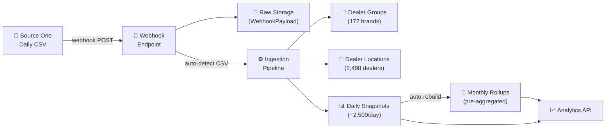
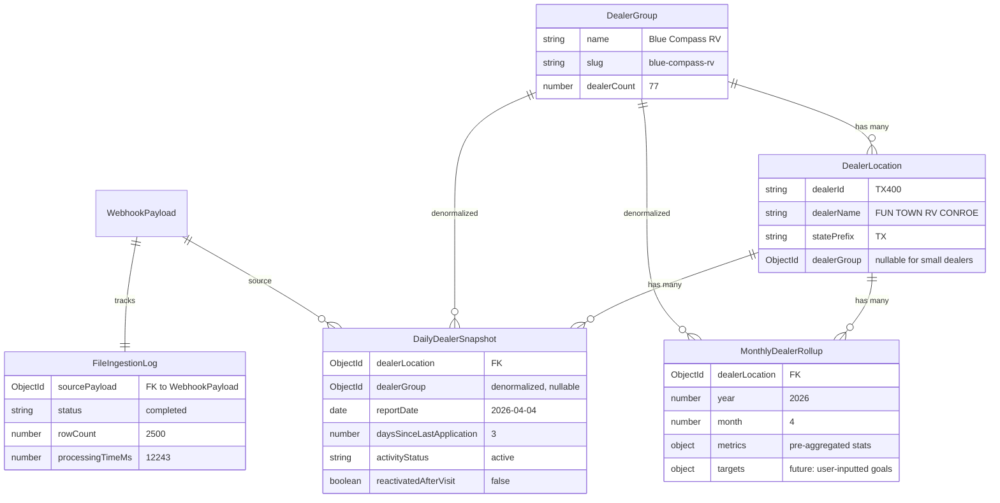

# Dealer Visit Data Pipeline — Architecture & API Guide

> **Last updated:** April 6, 2026  
> **Branch:** `feature/001-dealer-data-pipeline`

---

## How It Works

Every day, Source One sends us a CSV file (~2,500 rows) via webhook. Each row represents one dealer's activity snapshot for that day. Our pipeline automatically parses, structures, and aggregates this data so we can answer questions like:

- *"How is Blue Compass RV performing this month vs last month?"*
- *"Which dealers haven't submitted an application in 60+ days?"*
- *"What's the 30-day moving average for Fun Town RV Conroe?"*

> **Note:** Right now we only receive **one CSV file type** — the **daily dealer metrics report** (applications, approvals, bookings, activity status). The system is built to support additional file types in the future (different column sets for different reports), but currently this is the only one flowing in. When new report types are added, we register a new parser — no changes to the core pipeline needed.



---

## Data Model Overview

We have **5 collections** that work together. Here's how they relate:



---

## The CSV File We Receive (Currently the Only One)

Source One sends us **one file type right now**: the **Daily Dealer Metrics Report**. Each CSV has ~2,500 rows with these 13 columns:

| CSV Column | DB Field | Example | What It Means |
|-----------|----------|---------|---------------|
| `DEALER ID` | → links to `DealerLocation` | TX400 | Unique dealer identifier |
| `DEALER NAME` | → stored on `DealerLocation` | FUN TOWN RV CONROE | Full dealer name |
| `LAST APPLICATION DATE` | `lastApplicationDate` | 2026-04-04 | When they last submitted an application |
| `PRIOR APPLICATION DATE` | `priorApplicationDate` | 2026-04-01 | The application before that |
| `DAYS SINCE LAST APPLICATION` | `daysSinceLastApplication` | 2 | **Key metric** — lower = more active |
| `LAST APPROVAL DATE` | `lastApprovalDate` | 2026-04-04 | Last approved application |
| `DAYS SINCE LAST APPROVAL` | `daysSinceLastApproval` | 2 | Gap since last approval |
| `LAST BOOKED DATE` | `lastBookedDate` | 2026-03-15 | Last booked deal |
| `DAYS SINCE LAST BOOKING` | `daysSinceLastBooking` | 22 | Gap since last booking |
| `APPLICATION ACTIVITY STATUS` | `activityStatus` | active | One of: `active`, `30d_inactive`, `60d_inactive`, `long_inactive`, `never_active` |
| `LATEST COMMUNICATION DATETIME` | `latestCommunicationDatetime` | 2026-04-03 14:30 | Last sales rep contact |
| `REACTIVATED AFTER SALES VISIT FLAG` | `reactivatedAfterVisit` | 0 or 1 | Did a sales visit bring them back? |
| `DAYS FROM VISIT TO NEXT APPLICATION` | `daysFromVisitToNextApp` | 5 | How long after the visit they applied |

> **Future:** When Source One starts sending additional CSV report types (with different column headers), we register a new parser in `csvParserService.js` and create a new ingestion service. The webhook auto-detects the format by matching column headers.

---

## The Two Types of Dealers

| Type | Example | Group? | Count |
|------|---------|--------|-------|
| **Multi-location brand** | Blue Compass RV (77 locations), Fun Town RV (11 locations) | ✅ Assigned to a `DealerGroup` | ~700 dealers across 172 groups |
| **Small / independent dealer** | Auction Direct RV, Crabtree RV Center | ❌ `dealerGroup: null` | ~1,800 dealers |

A dealer group is **auto-detected** — if 2+ dealer IDs share the same brand name, they get grouped. Single-location dealers stay independent.

---

## Monthly Rollups (Pre-Aggregated)

Instead of querying thousands of daily snapshots, dashboards hit the `MonthlyDealerRollup` collection. These are **auto-rebuilt** after each CSV ingestion.

Each rollup contains:

| Metric | What It Tells You |
|--------|-------------------|
| `daysActive` | How many days this dealer was "active" status during the month |
| `daysInactive30` / `60` / `long` | Days in each inactive tier |
| `applicationDatesChanged` | How many new applications came in (detected by comparing consecutive days) |
| `approvalDatesChanged` | New approvals |
| `bookingDatesChanged` | New bookings |
| `reactivationEvents` | Times the dealer was flagged as reactivated after a sales visit |
| `avgDaysSinceLastApp` | Average gap between applications over the month |
| `minDaysSinceLastApp` / `max` | Best and worst application gaps |

---

## API Endpoints — Full Reference with Example Responses

All endpoints are prefixed with your server URL (e.g. `https://your-domain.vercel.app`).

---

### 1. Dashboard Overview

```
GET /analytics/overview
GET /analytics/overview?year=2026&month=3
```

Returns high-level stats across all dealers.

**Example response:**
```json
{
  "success": true,
  "overview": {
    "latestReportDate": "2026-04-04T00:00:00.000Z",
    "totalDealers": 2498,
    "totalGroups": 172,
    "statusBreakdown": [
      { "status": "active", "count": 1172 },
      { "status": "long_inactive", "count": 1013 },
      { "status": "30d_inactive", "count": 204 },
      { "status": "60d_inactive", "count": 109 }
    ],
    "reactivations": {
      "thisMonth": 203,
      "lastMonth": 269,
      "change": -66
    },
    "activeDealerAvg": {
      "avgDaysSinceLastApp": 8.8,
      "activeDealerCount": 1172
    },
    "period": { "year": 2026, "month": 4 }
  }
}
```

---

### 2. List All Dealer Groups

```
GET /analytics/groups
```

Returns all 172 groups sorted by location count.

**Example response:**
```json
{
  "success": true,
  "count": 172,
  "groups": [
    {
      "_id": "660f...",
      "name": "Blue Compass RV",
      "slug": "blue-compass-rv",
      "dealerCount": 77,
      "createdAt": "2026-04-06T16:16:00.000Z"
    },
    {
      "_id": "660f...",
      "name": "Fun Town RV",
      "slug": "fun-town-rv",
      "dealerCount": 11,
      "createdAt": "2026-04-06T16:16:00.000Z"
    },
    {
      "_id": "660f...",
      "name": "Lazydays RV",
      "slug": "lazydays-rv",
      "dealerCount": 11,
      "createdAt": "2026-04-06T16:16:00.000Z"
    }
  ]
}
```

---

### 3. Group → All Locations with Latest Status

```
GET /analytics/groups/la-mesa-rv-center/locations
```

Shows every location in the group along with their most recent snapshot.

**Example response:**
```json
{
  "success": true,
  "group": {
    "name": "La Mesa RV Center",
    "slug": "la-mesa-rv-center",
    "dealerCount": 10
  },
  "count": 10,
  "locations": [
    {
      "_id": "660f...",
      "dealerId": "SCA161",
      "dealerName": "La Mesa RV Center - San Diego - SCA161",
      "statePrefix": "SCA",
      "dealerGroup": "660f...",
      "latestSnapshot": {
        "reportDate": "2026-04-04T00:00:00.000Z",
        "activityStatus": "active",
        "daysSinceLastApplication": 7,
        "daysSinceLastApproval": 12,
        "daysSinceLastBooking": 45,
        "lastApplicationDate": "2026-03-29T00:00:00.000Z",
        "reactivatedAfterVisit": false
      }
    },
    {
      "_id": "660f...",
      "dealerId": "AZ355",
      "dealerName": "La Mesa RV Center - Tucson - AZ355",
      "statePrefix": "AZ",
      "dealerGroup": "660f...",
      "latestSnapshot": {
        "reportDate": "2026-04-04T00:00:00.000Z",
        "activityStatus": "60d_inactive",
        "daysSinceLastApplication": 81,
        "daysSinceLastApproval": 120,
        "daysSinceLastBooking": null,
        "lastApplicationDate": "2026-01-14T00:00:00.000Z",
        "reactivatedAfterVisit": false
      }
    }
  ]
}
```

---

### 4. Group Monthly Rollup (Aggregated Across All Locations)

```
GET /analytics/groups/fun-town-rv/monthly?year=2026
```

Aggregated monthly stats for the whole group.

**Example response:**
```json
{
  "success": true,
  "group": {
    "name": "Fun Town RV",
    "slug": "fun-town-rv",
    "dealerCount": 11
  },
  "year": 2026,
  "months": [
    {
      "month": 3,
      "year": 2026,
      "locationCount": 11,
      "metrics": {
        "daysActive": 40,
        "daysInactive30": 4,
        "daysInactive60": 0,
        "daysLongInactive": 0,
        "totalSnapshotDays": 44,
        "applicationDatesChanged": 5,
        "approvalDatesChanged": 6,
        "bookingDatesChanged": 5,
        "reactivationEvents": 0,
        "avgDaysSinceLastApp": 9.8,
        "avgDaysSinceLastApproval": 14.2,
        "avgDaysSinceLastBooking": 35.6
      }
    },
    {
      "month": 4,
      "year": 2026,
      "locationCount": 11,
      "metrics": {
        "daysActive": 29,
        "daysInactive30": 4,
        "daysInactive60": 0,
        "daysLongInactive": 0,
        "totalSnapshotDays": 33,
        "applicationDatesChanged": 6,
        "approvalDatesChanged": 3,
        "bookingDatesChanged": 1,
        "reactivationEvents": 0,
        "avgDaysSinceLastApp": 11.27,
        "avgDaysSinceLastApproval": 16.5,
        "avgDaysSinceLastBooking": 38.9
      }
    }
  ]
}
```

---

### 5. Single Dealer — Daily Trend

```
GET /analytics/dealers/TX400/trend?start=2026-03-28&end=2026-04-06
GET /analytics/dealers/TX400/trend?start=2026-03-01&end=2026-04-06&movingAvg=30
```

Day-by-day snapshots. Add `movingAvg=30` (or 60, 90) for a sliding-window average.

**Example response:**
```json
{
  "success": true,
  "dealerId": "TX400",
  "dealerName": "FUN TOWN RV CONROE -TX400",
  "dateRange": {
    "start": "2026-03-28T00:00:00.000Z",
    "end": "2026-04-06T00:00:00.000Z"
  },
  "count": 7,
  "snapshots": [
    {
      "reportDate": "2026-03-28T00:00:00.000Z",
      "activityStatus": "active",
      "daysSinceLastApplication": 3,
      "daysSinceLastApproval": 3,
      "daysSinceLastBooking": 12,
      "lastApplicationDate": "2026-03-25T00:00:00.000Z",
      "lastApprovalDate": "2026-03-25T00:00:00.000Z",
      "lastBookedDate": "2026-03-16T00:00:00.000Z",
      "reactivatedAfterVisit": false,
      "daysFromVisitToNextApp": null
    },
    {
      "reportDate": "2026-03-30T00:00:00.000Z",
      "activityStatus": "active",
      "daysSinceLastApplication": 1,
      "daysSinceLastApproval": 4,
      "daysSinceLastBooking": 14,
      "lastApplicationDate": "2026-03-29T00:00:00.000Z",
      "reactivatedAfterVisit": false
    },
    {
      "reportDate": "2026-03-31T00:00:00.000Z",
      "activityStatus": "active",
      "daysSinceLastApplication": 1,
      "daysSinceLastApproval": 1,
      "daysSinceLastBooking": 15,
      "reactivatedAfterVisit": false
    },
    {
      "reportDate": "2026-04-01T00:00:00.000Z",
      "activityStatus": "active",
      "daysSinceLastApplication": 2,
      "daysSinceLastApproval": 1,
      "reactivatedAfterVisit": false
    },
    {
      "reportDate": "2026-04-02T00:00:00.000Z",
      "activityStatus": "active",
      "daysSinceLastApplication": 3,
      "daysSinceLastApproval": 2,
      "reactivatedAfterVisit": false
    },
    {
      "reportDate": "2026-04-03T00:00:00.000Z",
      "activityStatus": "active",
      "daysSinceLastApplication": 1,
      "daysSinceLastApproval": 3,
      "reactivatedAfterVisit": false
    },
    {
      "reportDate": "2026-04-04T00:00:00.000Z",
      "activityStatus": "active",
      "daysSinceLastApplication": 2,
      "daysSinceLastApproval": 2,
      "reactivatedAfterVisit": false
    }
  ]
}
```

---

### 6. Single Dealer — Monthly Rollup

```
GET /analytics/dealers/NC153/monthly?year=2026
```

Monthly stats for one dealer.

**Example response:**
```json
{
  "success": true,
  "dealerId": "NC153",
  "dealerName": "Blue Compass RV - Charlotte - NC153",
  "year": 2026,
  "count": 2,
  "rollups": [
    {
      "dealerLocation": "660f...",
      "dealerGroup": "660f...",
      "year": 2026,
      "month": 3,
      "metrics": {
        "daysActive": 4,
        "daysInactive30": 0,
        "daysInactive60": 0,
        "daysLongInactive": 0,
        "totalSnapshotDays": 4,
        "applicationDatesChanged": 0,
        "approvalDatesChanged": 2,
        "bookingDatesChanged": 0,
        "reactivationEvents": 0,
        "avgDaysSinceLastApp": 2.5,
        "minDaysSinceLastApp": 1,
        "maxDaysSinceLastApp": 4,
        "avgDaysSinceLastApproval": 1.5,
        "avgDaysSinceLastBooking": 47.5
      },
      "targets": {}
    },
    {
      "dealerLocation": "660f...",
      "dealerGroup": "660f...",
      "year": 2026,
      "month": 4,
      "metrics": {
        "daysActive": 3,
        "daysInactive30": 0,
        "daysInactive60": 0,
        "daysLongInactive": 0,
        "totalSnapshotDays": 3,
        "applicationDatesChanged": 0,
        "approvalDatesChanged": 0,
        "bookingDatesChanged": 1,
        "reactivationEvents": 0,
        "avgDaysSinceLastApp": 6.33,
        "minDaysSinceLastApp": 5,
        "maxDaysSinceLastApp": 8,
        "avgDaysSinceLastApproval": 3.33,
        "avgDaysSinceLastBooking": 18
      },
      "targets": {}
    }
  ]
}
```

---

### 7. Ingestion Log (Processing History)

```
GET /webhook/ingestion-log
GET /webhook/ingestion-log?status=completed
GET /webhook/ingestion-log?status=failed&limit=5
```

Shows which CSVs have been received and processed.

**Example response:**
```json
{
  "success": true,
  "count": 8,
  "logs": [
    {
      "sourcePayload": "660e...",
      "fileName": "andrews_daily_dealer_metrics.csv.csv",
      "reportDate": "2026-04-04T00:00:00.000Z",
      "status": "completed",
      "rowCount": 2500,
      "dealersProcessed": 2499,
      "newDealers": 0,
      "newGroups": 0,
      "processingTimeMs": 12412,
      "createdAt": "2026-04-06T16:20:50.000Z",
      "completedAt": "2026-04-06T16:21:02.000Z"
    },
    {
      "sourcePayload": "660d...",
      "fileName": "andrews_daily_dealer_metrics.csv.csv",
      "reportDate": "2026-04-03T00:00:00.000Z",
      "status": "completed",
      "rowCount": 2499,
      "dealersProcessed": 2498,
      "newDealers": 1,
      "newGroups": 1,
      "processingTimeMs": 14089,
      "createdAt": "2026-04-06T16:20:36.000Z",
      "completedAt": "2026-04-06T16:20:50.000Z"
    },
    {
      "sourcePayload": "660a...",
      "fileName": "payload.csv",
      "reportDate": "2026-03-28T00:00:00.000Z",
      "status": "completed",
      "rowCount": 2489,
      "dealersProcessed": 2488,
      "newDealers": 2487,
      "newGroups": 170,
      "processingTimeMs": 188958,
      "createdAt": "2026-04-06T16:16:37.000Z",
      "completedAt": "2026-04-06T16:19:46.000Z"
    }
  ]
}
```

---

## Example Scenarios

### "How is Blue Compass RV doing this month?"

```
GET /analytics/groups/blue-compass-rv/monthly?year=2026
```

This returns aggregated metrics across all 77 Blue Compass locations for each month of 2026.

### "Which La Mesa locations are falling behind?"

```
GET /analytics/groups/la-mesa-rv-center/locations
```

Check each location's `latestSnapshot.activityStatus` and `daysSinceLastApplication`. In the current data, Tucson (AZ355) is 60-day inactive with 81 days since last app — the rest are active.

### "Show me Fun Town RV Conroe's daily trend"

```
GET /analytics/dealers/TX400/trend?start=2026-03-01&end=2026-04-06
```

Returns every daily snapshot. TX400 has been consistently active with 1-3 days between applications.

### "Compare this month's reactivations to last month"

```
GET /analytics/overview
```

The response includes `reactivations.thisMonth` (203) vs `reactivations.lastMonth` (269) with the delta (-66).

### "Is Lazydays RV active?"

```
GET /analytics/groups/lazydays-rv/monthly?year=2026
```

Nope — 0 active days across all 11 locations, avg 152 days since last app. They're dormant.

---

## File Structure

```
source-one-webhook/
├── models/
│   ├── DealerGroup.js          # Multi-location brand (e.g. Blue Compass RV)
│   ├── DealerLocation.js       # Individual dealer (e.g. TX400)
│   ├── DailyDealerSnapshot.js  # One row per dealer per day
│   ├── MonthlyDealerRollup.js  # Pre-aggregated monthly stats
│   ├── FileIngestionLog.js     # CSV processing tracker
│   └── WebhookPayload.js       # Raw webhook storage (existing)
├── services/
│   ├── csvParserService.js     # CSV parsing + format auto-detection
│   ├── dealerGroupDetector.js  # Brand name extraction + group management
│   ├── dealerMetricsIngestionService.js  # Full ingestion orchestrator
│   └── rollupService.js        # Monthly aggregation engine
├── routes/
│   └── analytics/
│       └── index.js            # All analytics API endpoints
├── scripts/
│   └── backfill.js             # One-time script to process existing CSVs
└── webhook/
    └── routes.js               # Webhook receiver (auto-triggers ingestion)
```

---

## How New CSVs Are Processed

1. Source One sends a CSV via `POST /webhook`
2. The raw file is saved to `WebhookPayload` (audit trail)
3. The webhook auto-detects CSV format by checking headers
4. **Fire-and-forget**: the response is sent back immediately (200 OK)
5. In the background:
   - CSV is parsed and validated
   - Dealer groups and locations are upserted
   - Daily snapshots are bulk-written (idempotent — safe to re-process)
   - Monthly rollups are rebuilt for the affected month
   - Processing status is logged to `FileIngestionLog`

**The whole process takes ~12 seconds per file** for ~2,500 dealers.

---

## Current Data (as of April 6, 2026)

| Collection | Documents |
|-----------|-----------|
| DealerGroups | 172 |
| DealerLocations | 2,498 |
| DailyDealerSnapshots | 17,455 |
| MonthlyDealerRollups | 4,991 |
| FileIngestionLogs | 8 |

**Date range covered:** March 28 – April 6, 2026 (8 daily files)

**File type:** Daily Dealer Metrics Report (the only CSV type we currently receive)
