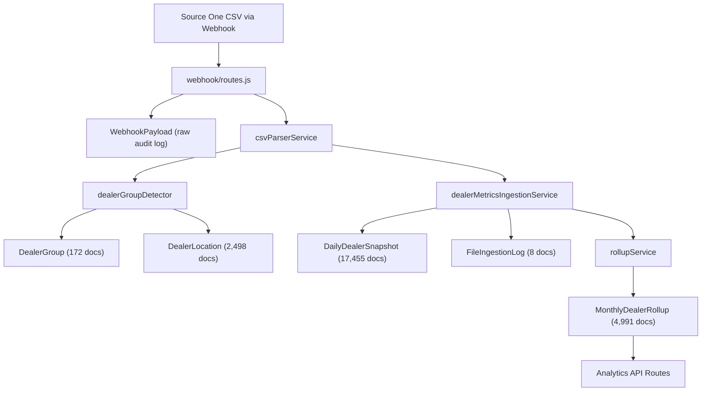

# Walkthrough — Dealer Visit Data Pipeline

## What Was Built

A complete CSV ingestion and analytics pipeline that transforms daily dealer metrics CSVs from Source One into structured, indexed MongoDB documents with pre-computed monthly rollups and query APIs.

## Architecture

---

## New Files

### Models (5 files)

| File | Purpose |
|------|---------|
| [DealerGroup.js](file:///home/joshg/viacore-v2/source-one-webhook/models/DealerGroup.js) | Auto-detected multi-location brands (e.g. "Blue Compass RV" with 77 locations) |
| [DealerLocation.js](file:///home/joshg/viacore-v2/source-one-webhook/models/DealerLocation.js) | Individual dealers with unique ID (e.g. TX400), optional group ref |
| [DailyDealerSnapshot.js](file:///home/joshg/viacore-v2/source-one-webhook/models/DailyDealerSnapshot.js) | One doc per dealer per day — core time-series data. 4 compound indexes |
| [MonthlyDealerRollup.js](file:///home/joshg/viacore-v2/source-one-webhook/models/MonthlyDealerRollup.js) | Pre-aggregated monthly stats with embedded metrics and future `targets` field |
| [FileIngestionLog.js](file:///home/joshg/viacore-v2/source-one-webhook/models/FileIngestionLog.js) | Processing status tracker per CSV file |

### Services (4 files)

| File | Purpose |
|------|---------|
| [csvParserService.js](file:///home/joshg/viacore-v2/source-one-webhook/services/csvParserService.js) | Generic CSV parser with quoted-field handling and pluggable format registry |
| [dealerGroupDetector.js](file:///home/joshg/viacore-v2/source-one-webhook/services/dealerGroupDetector.js) | Brand name extraction from dealer names, batch upsert of groups/locations |
| [dealerMetricsIngestionService.js](file:///home/joshg/viacore-v2/source-one-webhook/services/dealerMetricsIngestionService.js) | Orchestrates CSV parse → dealer resolve → snapshot upsert → rollup rebuild |
| [rollupService.js](file:///home/joshg/viacore-v2/source-one-webhook/services/rollupService.js) | Monthly rollup computation from daily snapshots |

### Routes & Scripts

| File | Purpose |
|------|---------|
| [routes/analytics/index.js](file:///home/joshg/viacore-v2/source-one-webhook/routes/analytics/index.js) | 6 analytics API endpoints |
| [scripts/backfill.js](file:///home/joshg/viacore-v2/source-one-webhook/scripts/backfill.js) | One-time script to process existing CSVs (idempotent) |

### Modified Files

| File | Change |
|------|--------|
| [index.js](file:///home/joshg/viacore-v2/source-one-webhook/index.js) | Mounted `/analytics` router |
| [webhook/routes.js](file:///home/joshg/viacore-v2/source-one-webhook/webhook/routes.js) | Added fire-and-forget CSV ingestion after save, added `/webhook/ingestion-log` route |

---

## Backfill Results

| Metric | Value |
|--------|-------|
| Files processed | 8 (Mar 28 – Apr 6, 2026) |
| DealerLocations | 2,498 |
| DealerGroups | 172 (multi-location brands) |
| Small dealers (ungrouped) | ~2,326 |
| DailyDealerSnapshots | 17,455 |
| MonthlyDealerRollups | 4,991 |
| Largest group | Blue Compass RV (77 locations) |

---

## API Endpoints

| Endpoint | Description |
|----------|-------------|
| `GET /analytics/overview` | Dashboard stats: active/inactive counts, reactivations this vs last month, avg days-since-app |
| `GET /analytics/groups` | List all dealer groups sorted by location count |
| `GET /analytics/groups/:slug/monthly?year=` | Aggregated monthly rollups for a group |
| `GET /analytics/groups/:slug/locations` | All locations in a group with latest snapshot |
| `GET /analytics/dealers/:dealerId/trend?start=&end=&movingAvg=` | Daily snapshots with optional 30/60/90d moving average |
| `GET /analytics/dealers/:dealerId/monthly?year=` | Monthly rollups for a dealer |
| `GET /webhook/ingestion-log?status=&limit=` | Processing status of ingested CSVs |

---

## Bugs Fixed During Development

1. **Mongoose 9 `next()` deprecation** — Pre-validate hooks no longer receive a `next` callback; switched to synchronous return
2. **Null slug collision** — `findOneAndUpdate` bypasses Mongoose middleware, so slug was never generated. Fixed by computing slug inline in the upsert `$set`
3. **Case-sensitive group detection** — "Fun Town RV" vs "FUN TOWN RV" weren't matching. Fixed by normalizing to uppercase before grouping

---

## Key Design Decisions

- **Small dealers stay ungrouped** — Single-location dealers have `dealerGroup: null`, not a synthetic group
- **Rollups are pre-computed** — Dashboard queries hit rollup docs, not raw snapshots. Rollups rebuild automatically after each ingestion
- **Parser registry pattern** — Future CSV formats register via `csvParserService.registerParser()` without touching existing code
- **Fire-and-forget ingestion** — Webhook returns 200 immediately; CSV processing runs async via `setImmediate`
- **`targets` field ready** — MonthlyDealerRollup has a `targets: Mixed` field for future user-inputted goals
